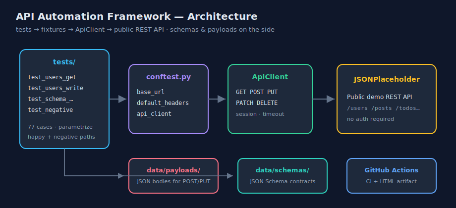
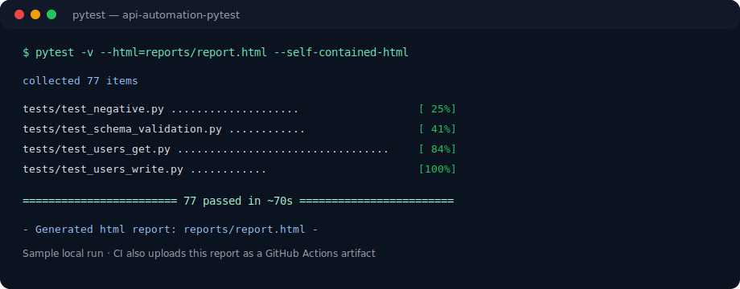
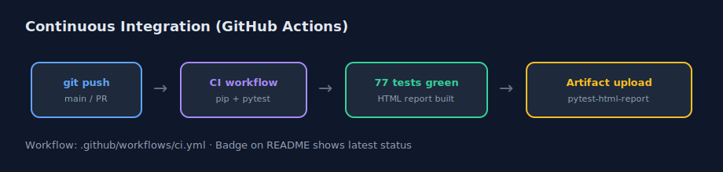

# API Automation Framework (Pytest)

[](https://github.com/nilima-satapathy/api-automation-pytest/actions/workflows/ci.yml)
[](https://www.python.org/)
[](https://pytest.org/)
[](./MILESTONES.md)
[](./tests)

> Maintainable **REST API test automation** in Python — reusable client, fixtures, data-driven tests, JSON Schema contracts, negative cases, HTML reports, and GitHub Actions CI.

**Author:** [Nilima Satapathy](https://github.com/nilima-satapathy) · Portfolio board: **[ai-career-journey](https://github.com/nilima-satapathy/ai-career-journey)**

| | |
|--|--|
| **Target API** | [JSONPlaceholder](https://jsonplaceholder.typicode.com) (public, no auth) |
| **Stack** | Python · Pytest · requests · jsonschema · pytest-html · GitHub Actions |
| **Status** | ✅ **Project complete** (Milestones 1–8) |
| **Suite size** | **77** automated tests |

---

## Why this project

Portfolio project for **SDET / AI Test Engineer** roles. It demonstrates production-style API testing habits:

- Separate **how we call the API** (`ApiClient`) from **what we assert** (tests)
- Shared setup via **Pytest fixtures**
- **Data-driven** coverage with `@pytest.mark.parametrize`
- Request bodies and response **contracts** as JSON files
- **Negative / edge cases**, not only happy path
- **CI on every push** with a downloadable HTML report

This is the foundation skill set for later **LLM API testing** and GenAI quality work.

---

## Architecture



```text
tests/  →  fixtures (conftest)  →  ApiClient  →  REST API
   │                                  │
   ├─ data/payloads/   (POST/PUT bodies)
   └─ data/schemas/    (JSON Schema contracts)
```

---

## Features

| Area | What you get |
|------|----------------|
| **HTTP client** | Thin `ApiClient` — GET, POST, PUT, PATCH, DELETE, shared session/headers/timeout |
| **Fixtures** | `base_url`, `default_headers`, `api_client` (create + close per test) |
| **Read coverage** | Users, posts, comments, todos, albums; filters; nested routes |
| **Write coverage** | Create / update / partial update / delete with payload files |
| **Contracts** | JSON Schema validation (`jsonschema` Draft 7) |
| **Negatives** | 404s, empty filters, unknown routes, write-side edge cases |
| **Reporting** | Local + CI **pytest-html** self-contained report |
| **CI** | GitHub Actions on push/PR · artifact upload · green badge |

---

## Quick start (Windows)

```powershell
git clone https://github.com/nilima-satapathy/api-automation-pytest.git
cd api-automation-pytest
python -m venv .venv
.\.venv\Scripts\Activate.ps1
pip install -r requirements.txt
pytest
```

### HTML report

```powershell
mkdir reports -Force
pytest --html=reports/report.html --self-contained-html
```

Open `reports/report.html` in any browser.

### Optional base URL

```powershell
$env:API_BASE_URL = "https://jsonplaceholder.typicode.com"
pytest
```

> **Note:** Tests hit a public demo API. Occasional network/5xx blips can make a run flaky; re-run if a single request fails with 502.

---

## Sample results



| File | Focus | Approx. cases |
|------|--------|----------------|
| `tests/test_users_get.py` | GET + parametrize | 33 |
| `tests/test_users_write.py` | POST / PUT / PATCH / DELETE | 12 |
| `tests/test_schema_validation.py` | JSON Schema contracts | 12 |
| `tests/test_negative.py` | 404s, empty results, edge cases | 20 |
| **Total** | | **77** |

---

## Continuous Integration



On every **push** and **pull request** to `main`:

1. Install dependencies  
2. Run the full suite  
3. Upload artifact **`pytest-html-report`**

- Workflow: [`.github/workflows/ci.yml`](./.github/workflows/ci.yml)  
- Actions: [CI runs](https://github.com/nilima-satapathy/api-automation-pytest/actions)  
- To download the report: open a green run → **Artifacts** → `pytest-html-report`

---

## Project structure

```text
api-automation-pytest/
├── .github/workflows/ci.yml      # CI: pytest + HTML artifact
├── docs/assets/                  # Portfolio diagrams (README images)
├── MILESTONES.md                 # Milestone log + tags
├── README.md
├── requirements.txt
├── pytest.ini
├── tests/
│   ├── conftest.py               # fixtures
│   ├── test_users_get.py         # GET / parametrize
│   ├── test_users_write.py       # write operations
│   ├── test_schema_validation.py # contracts
│   └── test_negative.py          # unhappy paths
├── utils/
│   ├── api_client.py             # HTTP wrapper
│   ├── payload_loader.py
│   └── schema_loader.py
└── data/
    ├── payloads/                 # request JSON
    └── schemas/                  # response schemas
```

---

## Milestone journey (complete)

| # | Milestone | Tag |
|---|-----------|-----|
| 1 | Structure + `ApiClient` + first GETs | `milestone-1` |
| 2 | Shared fixtures | `milestone-2` |
| 3 | Full GET + parametrize | `milestone-3` |
| 4 | POST / PUT / DELETE + payloads | `milestone-4` |
| 5 | Schema validation | `milestone-5` |
| 6 | Negative tests | `milestone-6` |
| 7 | pytest-html + GitHub Actions | `milestone-7` |
| 8 | README polish + portfolio assets | `milestone-8` |

Details: **[MILESTONES.md](./MILESTONES.md)**

---

## Interview talking points

1. **ApiClient** — one place for base URL, headers, timeout (DRY; easy to add auth later).  
2. **Fixtures** — setup/teardown stay out of test bodies.  
3. **Assertions** — status + shape + business rules, not status alone.  
4. **Parametrize** — scale coverage without copy-paste; clear failure per data row.  
5. **Payloads & schemas as files** — reviewers can inspect contracts without reading Python.  
6. **Negative tests** — distinguish **404** vs **200 + empty list**.  
7. **CI + HTML report** — evidence for every change; recruiters can open Actions.  
8. **Honest demo-API notes** — document quirks (e.g. fake writes) instead of inventing behavior.

---

## Design choices

| Choice | Why |
|--------|-----|
| JSONPlaceholder | Free, stable, no API key for portfolio demos |
| Thin client over raw `requests` | Readable tests; one place to add retries/auth later |
| Schema files | Contract testing lite — catches field/type regressions |
| Self-contained HTML | Report opens offline; CI artifact is shareable |

---

## License / use

Portfolio project for learning and job applications. Feel free to fork for practice.

---

*Built as Project 1 of my [AI career journey](https://github.com/nilima-satapathy/ai-career-journey) · Nilima Satapathy*
